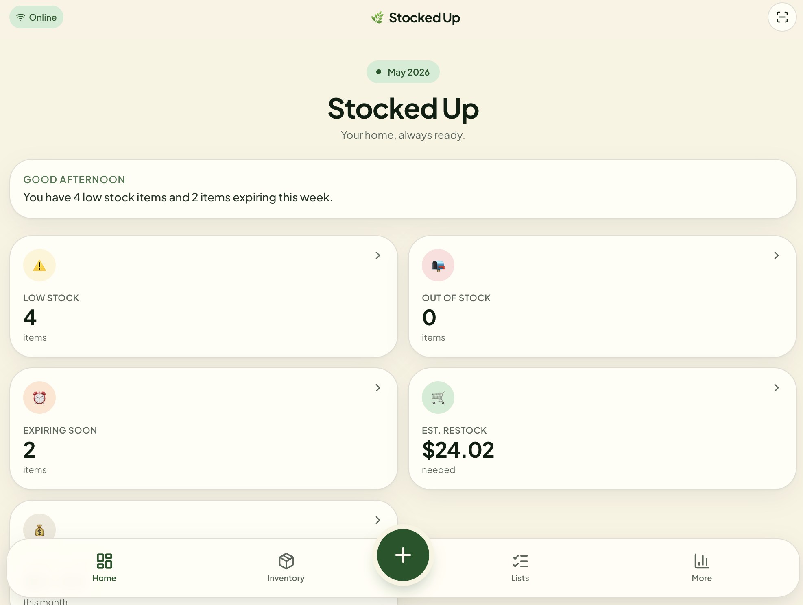
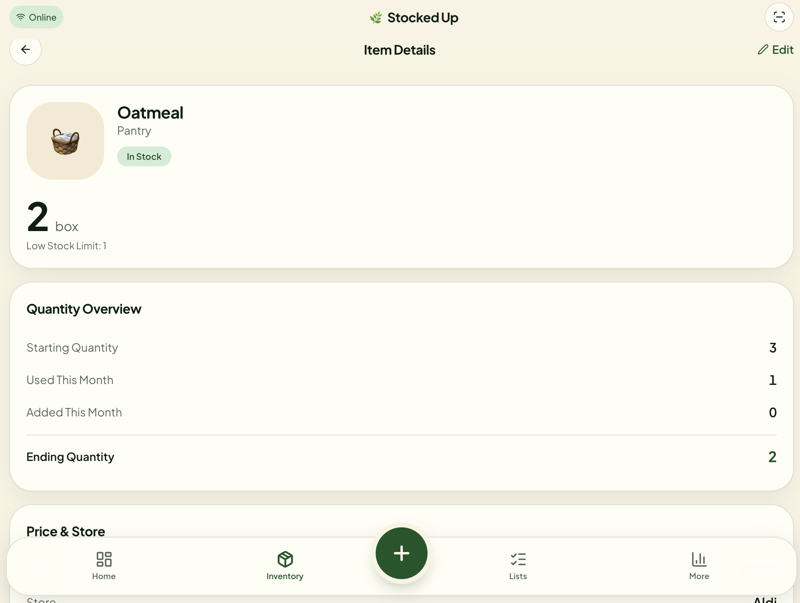

# 🌿 Stocked Up

**Your home, always ready.**

Stocked Up is an AI-powered household inventory and preparedness app designed to help users track inventory, monitor household health, plan shopping trips, and reduce waste. From pantry staples to beauty products, Stocked Up helps households stay organized and prepared.

🔗 **Live Demo:** https://cozy-inventory-ai.lovable.app  
🔗 **GitHub Repository:** https://github.com/riahdollxo/stocked-up

---

## ✨ Features

### 🏠 Household Inventory Management
- Track food, household goods, beauty products, and more
- Monitor low stock and out-of-stock items
- Estimate monthly restocking costs
- View household activity logs

### 🔍 Product Search
- Search by product name, brand, barcode, or store
- Barcode scanning support
- Product images and pricing when available
- Add items directly to inventory or shopping lists

### 🛒 Shopping Tools
- Smart shopping lists
- Restock recommendations
- Monthly inventory resets
- Estimated restocking budgets

### 🍽️ What's For Dinner
- Generate meal ideas based on available inventory
- Reduce food waste by using what you already have

### 🌾 Farmers Market Mode
- Discover nearby farmers markets
- Shop local produce and vendors
- Track market purchases
- Add market purchases directly to inventory
- Support ZIP code and location-based searches

### 🤖 AI Features
- Household insights
- Inventory predictions
- Preparedness scoring
- Smart recommendations

---

## 📱 Screenshots

### Dashboard


### Inventory


---

## 🛠️ Built With

- **Lovable AI**
- **React**
- **TypeScript**
- **Supabase**
- **Open Food Facts API**
- **Barcode APIs**
- **Location Services**

---

## 🚀 Getting Started

### Clone the repository

```bash
git clone https://github.com/YOUR-USERNAME/stocked-up.git
cd stocked-up
```

### Install dependencies

```bash
npm install
```

### Start development server

```bash
npm run dev
```

---

## 🎯 Vision

Stocked Up aims to become an all-in-one household management platform that empowers individuals and families to:

- Stay organized
- Reduce waste
- Prepare for emergencies
- Support local food systems
- Make smarter purchasing decisions

---

## 🔮 Future Features

- Multi-household support
- Shared family accounts
- Advanced budgeting
- Weather preparedness alerts
- Local farmers market integration
- Community resource discovery

---

## 👩🏾‍💻 Creator

Created with ❤️ by **Mariah Piggs**

- GitHub: https://github.com/riahdollxo
- LinkedIn: [https://www.linkedin.com/in/YOUR-LINKEDIN/](https://www.linkedin.com/in/mariah-piggs-a428a589/)

---

## 📄 License

This project is licensed under the MIT License.
